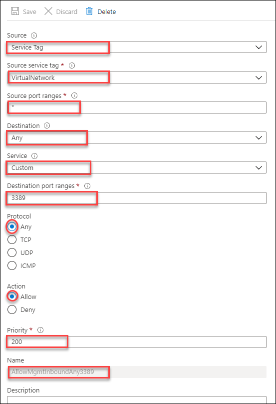

## Exercise 3: Configure Network Security Groups and Application Security Groups

Duration: 20 minutes

In this exercise, you will restrict traffic between tiers of n-tier application by using network security groups and application security groups.

### Task 1: Create application security groups

1.  In the Azure portal, select **+ Create a resource**. In the **Search the Marketplace**, type **Application security group** and press Enter. Next, on the **Application security group** blade, select **Create**.

2.  On the **Create an application security group** blade, on the **Basics** tab, enter the following information, and select **Review + create**:

    -  Subscription: **Select your subscription**.

    -  Resource group: **WGVNetRG2**

    -  Name: **WebTier**

    -  Region: **(US) South Central US** (This must match the location in which you created the **WGVNet2** virtual network.)

    

3.  On the **Create an application security group** blade, on the **Review + Create** tab, ensure the validation passes, and select **Create**. 

4.  Repeat the previous two steps to create an application security group named **DataTier** with the settings matching those on the following screenshot.

    -  Subscription: **Select your subscription**.

    -  Resource group: **WGVNetRG2**

    -  Name: **DataTier**

    -  Region: **(US) South Central US** (This must match the location in which you created the **WGVNet2** virtual network.)

    

### Task 2: Configure application security groups

1.  In the Azure portal, navigate to the **Virtual machines** blade and select **WGWEB1**.

2.  On the **WGWEB1** blade, select **Networking** under **Settings** on the left.

3.  On the **WGWEB1 - Networking** blade, select **Application security groups** and then select **Configure the application security groups**.

4.  On the **Configure the application security groups** blade, in the **Application security groups** drop-down list, select **WebTier**, then **Save**.

    

5.  Repeat steps 1-4, but this time for **WGWEB2** in order to assign to its network interface the **WebTier** application security group.

6.  Repeat steps 1-4, but this time for **WGSQL1** in order to assign to its network interface the **DataTier** application security group.

### Task 3: Create network security group

1.  In the Azure portal, select **+ Create a resource**. In the **Search the Marketplace**, type **Network security group** and press Enter. Select it and on the **Network security group** blade, select **Create**.

2.  On the **Create network security group** blade, enter the following information, and select **Review + Create** then **Create**:
   
    -  Subscription: **Select your subscription**.

    -  Resource group: **WGVNetRG2**

    -  Name: **WGAppNSG1**

    -  Region: **(US) South Central US** (This must match the location in which you created the **WGVNet2** virtual network.)

    

3.  In the Azure Portal, navigate to **All Services**, type **Network security groups** the search box and select **Network security groups**.

4.  On the **Network security groups** blade, select **WGAppNSG1**. 

5.  On the **WGAppNSG1** blade, select **Inbound security rules** under **Settings** on the left and select **+Add**.

6.  On the **Add inbound security rule** blade, enter the following information, and select **Add**:

    -  Source: **Application security group**

    -  Source application security group: **WebTier**

    -  Source port ranges: **\***

    -  Destination: **Application security group**

    -  Destination application security group: **DataTier**

    -  Destination port ranges: **1433**

    -  Protocol: **TCP**

    -  Action: **Allow**

    -  Priority: **100**

    -  Name: **AllowDataTierInboundTCP1433**

    

7.  On the **WGAppNSG1 - Inbound security rules** blade, select **Add**.

8.  On the **Add inbound security rule** blade, enter the following information, and select **Add**:

    -  Source: **Any**

    -  Source port ranges: **\***

    -  Destination: **Application security group**

    -  Destination application security group: **WebTier**

    -  Destination port ranges: **80**

    -  Protocol: **TCP**

    -  Action: **Allow**

    -  Priority: **150**

    -  Name: **AllowAnyWebTierInboundTCP80**

    

9.  On the **WGAppNSG1 - Inbound security rules** blade, select **+Add**.

10. On the **Add inbound security rule** blade, enter the following information, and select **Add**:

    -  Source: **Service Tag**

    -  Source Service Tag: **Virtual Network**

    -  Source port ranges: **\***

    -  Destination: **Any**

    -  Destination port ranges: **3389**

    -  Protocol: **Any**

    -  Action: **Allow**

    -  Priority: **200**

    -  Name: **AllowMgmtInboundAny3389**

    

11. On the **WGAppNSG1 - Inbound security rules** blade, select **Add**.

12. On the **Add inbound security rule** blade, enter the following information, and select **Add**:

    -  Source: **Service Tag**

    -  Source service tag: **VirtualNetwork**

    -  Source port ranges: **\***

    -  Destination: **Application security group**

    -  Destination application security group: **DataTier**

    -  Destination port ranges: **\***

    -  Protocol: **Any**

    -  Action: **Deny**

    -  Priority: **1000**

    -  Name: **DenyVNetDataTierInbound**

    

13. On the **WGAppNSG1 - Inbound security rules** blade, select **Add**.

14. On the **Add inbound security rule** blade, enter the following information, and select **Add**:

    -  Source: **Service Tag**

    -  Source service tag: **VirtualNetwork**

    -  Source port ranges: **\***

    -  Destination: **Application security group**

    -  Destination application security group: **WebTier**

    -  Destination port ranges: **\***

    -  Protocol: **Any**

    -  Action: **Deny**

    -  Priority: **1050**

    -  Name: **DenyVNetWebTierInbound**

    

15. On the **WGAppNSG1 - Inbound security rules** blade, select **Subnets** under **Settings** and then select **+ Associate**.

16. On the **Associate subnet** blade, select **WGVNet2** on the **Virtual network** drop down and **AppSubnet** on the **Subnet** dropdown.

17. Select **OK** at the bottom of the **Associate subnet** blade.

